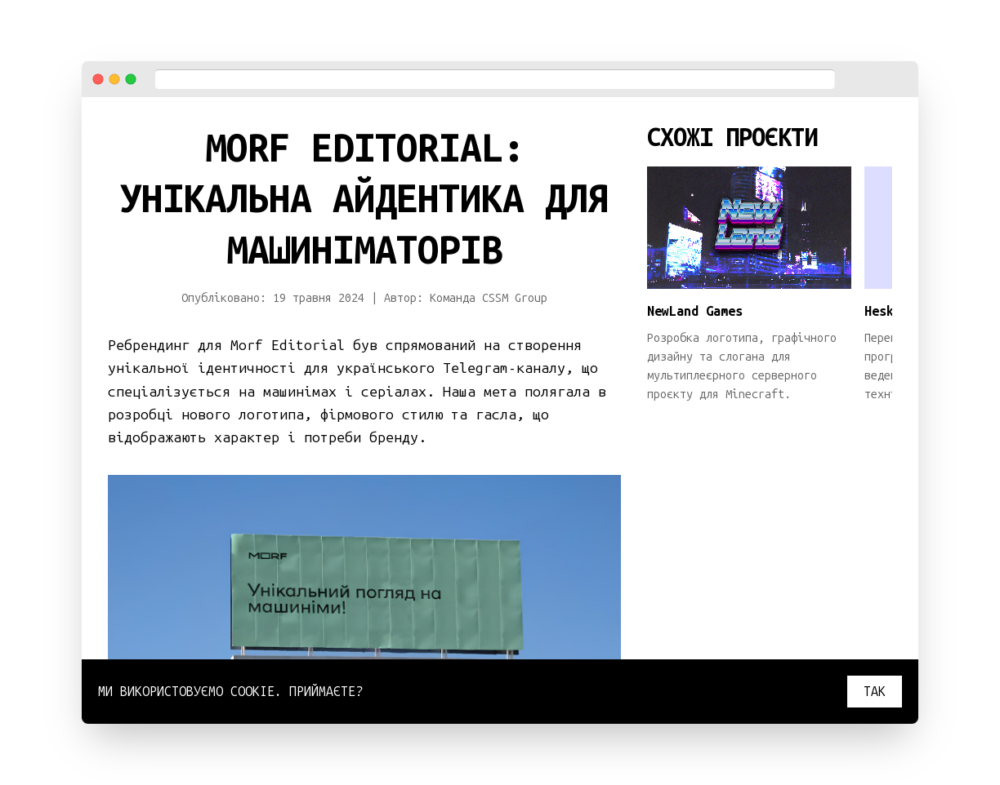

# CSSM Official Website

[](https://app.netlify.com/sites/cssm-group/deploys)

Welcome to the official website for CSSM. This repository contains the source code for the CSSM website.

## Technologies Used

- **JavaScript**: 76.8%
- **CSS**: 23.2%

## Getting Started



To deploy a local copy of a project, follow a few simple steps.

### Prerequisites

Before you begin, install the following tools:

- Node.js
- npm

### Installation

1. Clone the repo:
   ```bash
   git clone https://github.com/Fyennyi/cssm-group.git
   ```
2. Install NPM packages:
   ```bash
   npm install
   ```

### Usage

To start the development server:

```bash
npm start
```

### Deployment

This project is deployed on Netlify. You can view the latest deployment status above.

## Contributing

Contributions are welcome and appreciated! Here's how you can contribute:

1. Fork the project
2. Create your feature branch (`git checkout -b feature/AmazingFeature`)
3. Commit your changes (`git commit -m 'Add some AmazingFeature'`)
4. Push to the branch (`git push origin feature/AmazingFeature`)
5. Open a Pull Request

Please make sure to update tests as appropriate and adhere to the existing coding style.

## License

This project is licensed under the CSSM Unlimited License v2 (CSSM-ULv2). See the [LICENSE](LICENSE) file for details.
